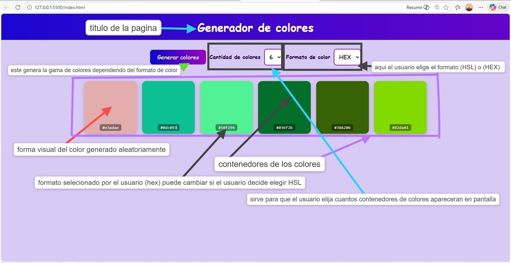

# 🎨 Generador de Colores
**Autor:** Josue Kaleth Salazar  
**GitHub:** [@Taimolrvz007](https://github.com/Taimolrvz007)

Aplicación web estática e interactiva que genera paletas de colores aleatorias en formatos **HEX** y **HSL**. Permite elegir la cantidad de colores, copiar cualquier código con un clic y visualizar cada muestra de forma clara.

---

## 📖 Manual de Usuario

### ¿Cómo usar la aplicación?

1. **Seleccionar la cantidad de colores**  
   Usá el selector *"Cantidad de colores"* para elegir entre **6, 8 o 9** colores en tu paleta.

2. **Elegir el formato de color**  
   Usá el selector *"Formato de color"* para cambiar entre:
   - **HEX**: formato hexadecimal (ej. `#a3f2c1`)
   - **HSL**: matiz, saturación y luminosidad (ej. `hsl(180, 60%, 70%)`)

3. **Generar la paleta**  
   Hacé clic en el botón **"Generar colores"** para crear una nueva combinación aleatoria. La paleta también se actualiza automáticamente al cambiar la cantidad de colores.

4. **Copiar un código de color**  
   Hacé clic sobre cualquier tarjeta (o presioná **Enter** / **Space** con el teclado sobre ella) para **copiar su código al portapapeles**. Aparecerá un mensaje de confirmación en la parte inferior de la pantalla.

---

## ⚙️ Manual Técnico — Decisiones Técnicas

### Estructura del proyecto

```
ProyectoM1_JosueKalethSalazar/
├── index.html    # Estructura semántica de la app
├── style.css     # Estilos y animaciones
├── main.js       # Lógica de generación y comportamiento
└── README.md     # Documentación
```

### Tecnologías utilizadas

- **HTML5** semántico (`<header>`, `<main>`, `<label>`, `role`, `aria-*`)
- **CSS3** puro (sin frameworks): flexbox, `@keyframes`, transiciones, `:focus-visible`
- **JavaScript** vanilla (ES6+): manipulación del DOM, Clipboard API, eventos de teclado y mouse

### Decisiones de diseño

| Decisión | Justificación |
|---|---|
| Vanilla JS sin frameworks | Proyecto de alcance acotado; evita overhead innecesario |
| `Math.random() * 16777215` para HEX | Cubre todo el espacio de colores RGB (0x000000 a 0xFFFFFF) |
| `toString(16).padStart(6, '0')` | Garantiza siempre 6 dígitos (ej. `#00ff00` en lugar de `#ff00`) |
| Generación HSL con rangos H(0-360), S(0-100), L(0-100) | Produce colores válidos en todo el espectro HSL |
| Clipboard API nativa | Copia al portapapeles sin librerías externas |
| Re-render completo al cambiar cantidad | Simplifica el estado: siempre se parte de cero al cambiar parámetros |
| Tooltip con `position: fixed` | Visible independientemente del scroll de la página |

### Accesibilidad

- **Labels asociados**: cada `<select>` tiene su `<label for="">` correspondiente.
- **Foco visible**: estilos `:focus-visible` definidos explícitamente en botón, selects y tarjetas.
- **Contraste suficiente**: el código de color se muestra sobre `rgba(0,0,0,0.4)` para garantizar legibilidad sobre cualquier fondo.
- **Navegación por teclado**: las tarjetas tienen `tabindex="0"` y responden a `Enter` y `Space`.
- **ARIA**: cada tarjeta incluye `aria-label` descriptivo y `role="button"`.

---

## 💻 Ejecutar en local

### Requisitos

- Navegador moderno (Chrome, Firefox, Edge, Safari)
- [Git](https://git-scm.com/) instalado

### Pasos

```bash
# 1. Clonar el repositorio
git clone https://github.com/Taimolrvz007/ProyectoM1_JosueKalethSalazar.git

# 2. Ingresar a la carpeta
cd ProyectoM1_JosueKalethSalazar

# 3. Abrir el archivo en el navegador
# Opción A: doble clic sobre index.html
# Opción B: con extensión Live Server en VS Code → clic derecho → "Open with Live Server"
```

> No se requiere ningún servidor, dependencia ni instalación adicional. El proyecto funciona directamente como archivos estáticos.

---

## 🚀 Desplegar en GitHub Pages

### Pasos para publicar

1. **Subir el proyecto a GitHub**
   ```bash
   git init
   git add .
   git commit -m "feat: initial commit - generador de colores"
   git branch -M main
   git remote add origin https://github.com/Taimolrvz007/ProyectoM1_JosueKalethSalazar.git
   git push -u origin main
   ```

2. **Activar GitHub Pages**
   - Ir al repositorio en GitHub
   - Clic en **Settings** → **Pages** (menú lateral)
   - En *Source*, seleccionar la rama **`main`** y la carpeta **`/ (root)`**
   - Clic en **Save**

3. **Acceder a la app**  
   Luego de unos segundos, la app estará disponible en:
   ```
   https://Taimolrvz007.github.io/ProyectoM1_JosueKalethSalazar/
   ```

> Cada vez que hagas `git push` a `main`, GitHub Pages actualizará el sitio automáticamente.

## 📸 Vista previa
